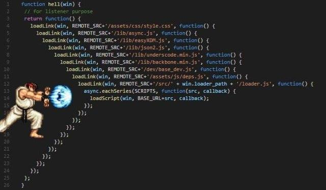

#+TITLE: Node.js Callbacks
#+AUTHOR: Fernando Basso
#+STARTUP: content

* Callbacks

https://nodejs.org/learn/asynchronous-work/javascript-asynchronous-programming-and-callbacks

JavaScript is synchronous by default; and single-threaded.

Lines of code run one after another.

The browser and node.js provide an environment that can handle
asynchronous operations.

We don’t know when something will happen (a click of a button, the
window loads, a file upload finishes, a write to the database is
complete, etc.), so, we listen to an event and call a function when that
event happens.

#+begin_src javascript
btn.addEventListener('click', function btnClicked() {
  // The button was clicked.
});

window.addEventListener('load', function windowLoaded() {
  // The page as loaded.
});

// Do this at 2 secons or a bit later.
setTimeout(function afterTwoSeconds() {
  // Two seconds (or a bit more) have passed.
}, 2000);
#+end_src

** Node.js error-first callbacks

#+begin_src javascript
const fs = require("node:fs");

fs.readFile("./package.json", function handleRead(err, data) {
  if (err) {
    log(err);
    return;
  }

  log(data);
}
#+end_src

Callbacks are useful in so many ways, but sometimes we end up in the so
called “callback hell”.

#+DOWNLOADED: screenshot @ 2026-06-28 11:25:05

